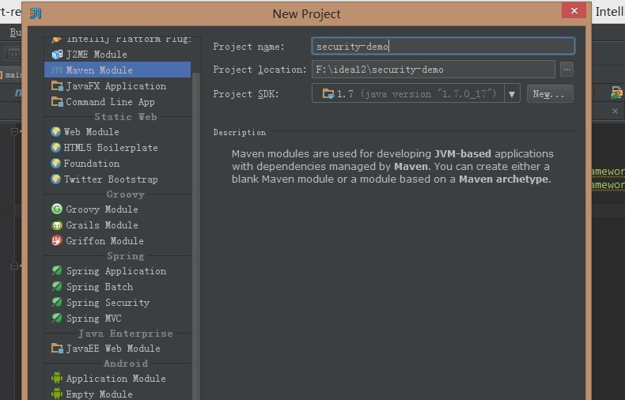
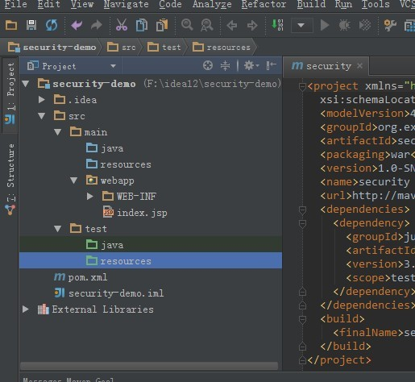

### 说明
一直在用spring security与shiro权限框架。最近spring security升级到了3.2.0.M1,所以更新了一下，看一下是否还是可以按照老方法使用。

### 基于方法级别的权限控制
spring security通过用户角色的URL来限制访问,通常是用来保护Web应用程序的。然而，它也可以用在方法和类上，使编码或配置错误不允许后门进入受限制的数据。构建安全系统深入而不弄乱代码。它还允许额外的灵活性，如允许用户只能访问与他们相关的信息，而不是其他用户的信息。

下面的代码演示了基于方法基本的一部分Spring Security的展示，这个应用程序还演示各种功能和技术在后面的文章中说明。

### 初始环境与工具
下面的环境与工具有想必大家开发JAVA的同学不会陌生吧！我就不介绍它们的安装了。
+ SDK
+ MAVEN
+ myeclipse 或者 IDEA （我本人习惯于IDEA，这个教程就用它了）

### 基本结构
运行idea创建一个maven项目

创建完成后补全目录结构，如下：

### 运用maven 添加依赖
 什么依赖大家就自己看吧，具体代码如下：

     <project xmlns="http://maven.apache.org/POM/4.0.0" xmlns:xsi="http://www.w3.org/2001/XMLSchema-instance"
      xsi:schemaLocation="http://maven.apache.org/POM/4.0.0 http://maven.apache.org/maven-v4_0_0.xsd">
      <modelVersion>4.0.0</modelVersion>
      <groupId>org.excalibur</groupId>
      <artifactId>security</artifactId>
      <packaging>war</packaging>
      <version>1.0-SNAPSHOT</version>
      <name>security Maven Webapp</name>
      <url>http://maven.apache.org</url>

        <properties>
            <project.build.sourceEncoding>UTF-8</project.build.sourceEncoding>
            <junit.version>4.10</junit.version>
            <!--about spring -->
            <spring.version>4.0.0.M1</spring.version>
            <spring.security.version>3.2.0.M1</spring.security.version>
            <log4j.version>1.2.17</log4j.version>
            <slf4j.version>1.7.1</slf4j.version>
            <!-- plugin-->
            <jetty.version>8.1.5.v20120716</jetty.version>
        </properties>

        <repositories>
            <!-- spring security 仓库 -->
            <repository>
                <id>repository.springframework.security</id>
                <name>Spring security Maven Repository</name>
                <url>http://repo1.maven.org/maven2/org/springframework/security/</url>
            </repository>
        </repositories>

      <dependencies>
          <dependency>
              <groupId>org.springframework</groupId>
              <artifactId>spring-webmvc</artifactId>
              <version>${spring.version}</version>
          </dependency>
          <dependency>
              <groupId>org.springframework</groupId>
              <artifactId>spring-web</artifactId>
              <version>${spring.version}</version>
          </dependency>

          <!-- test start-->
          <!-- junit-->
          <dependency>
              <groupId>junit</groupId>
              <artifactId>junit</artifactId>
              <version>${junit.version}</version>
              <scope>test</scope>
          </dependency>
          <dependency>
              <groupId>org.springframework</groupId>
              <artifactId>spring-test</artifactId>
              <version>${spring.version}</version>
          </dependency>
          <!-- test end-->
          <!-- spring basic start -->
          <dependency>
              <groupId>org.springframework</groupId>
              <artifactId>spring-core</artifactId>
              <version>${spring.version}</version>
              <exclusions>
                  <exclusion>
                      <groupId>commons-logging</groupId>
                      <artifactId>commons-logging</artifactId>
                  </exclusion>
              </exclusions>
          </dependency>
          <dependency>
              <groupId>org.springframework</groupId>
              <artifactId>spring-context</artifactId>
              <version>${spring.version}</version>
              <exclusions>
                  <!-- Exclude Commons Logging in favor of SLF4j -->
                  <exclusion>
                      <groupId>commons-logging</groupId>
                      <artifactId>commons-logging</artifactId>
                  </exclusion>
              </exclusions>
          </dependency>
          <dependency>
              <groupId>org.springframework</groupId>
              <artifactId>spring-beans</artifactId>
              <version>${spring.version}</version>
          </dependency>
          <dependency>
              <groupId>org.springframework</groupId>
              <artifactId>spring-context-support</artifactId>
              <version>${spring.version}</version>
          </dependency>
          <dependency>
              <groupId>org.springframework</groupId>
              <artifactId>spring-tx</artifactId>
              <version>${spring.version}</version>
          </dependency>
          <dependency>
              <groupId>org.springframework</groupId>
              <artifactId>spring-oxm</artifactId>
              <version>${spring.version}</version>
          </dependency>
          <!-- spring basic end -->
          <!--spring security start-->
          <dependency>
              <groupId>org.springframework.security</groupId>
              <artifactId>spring-security-core</artifactId>
              <version>${spring.security.version}</version>
          </dependency>
          <dependency>
              <groupId>org.springframework.security</groupId>
              <artifactId>spring-security-web</artifactId>
              <version>${spring.security.version}</version>
          </dependency>
          <dependency>
              <groupId>org.springframework.security</groupId>
              <artifactId>spring-security-config</artifactId>
              <version>${spring.security.version}</version>
          </dependency>

          <dependency>
              <groupId>org.springframework.security</groupId>
              <artifactId>spring-security-aspects</artifactId>
              <version>${spring.security.version}</version>
          </dependency>

          <!--spring security end-->
          <!-- web begin-->
          <dependency>
              <groupId>javax.servlet</groupId>
              <artifactId>jstl</artifactId>
              <version>1.2</version>
          </dependency>

          <dependency>
              <groupId>javax.servlet</groupId>
              <artifactId>servlet-api</artifactId>
              <version>2.5</version>
              <scope>provided</scope>
          </dependency>
          <dependency>
              <groupId>javax.servlet.jsp</groupId>
              <artifactId>javax.servlet.jsp-api</artifactId>
              <version>2.2.1</version>
              <scope>provided</scope>
          </dependency>
          <dependency>
              <groupId>taglibs</groupId>
              <artifactId>standard</artifactId>
              <version>1.1.2</version>
              <scope>provided</scope>
          </dependency>

          <dependency>
              <groupId>org.springframework</groupId>
              <artifactId>spring-webmvc</artifactId>
              <version>${spring.version}</version>
          </dependency>
          <dependency>
              <groupId>org.springframework</groupId>
              <artifactId>spring-web</artifactId>
              <version>${spring.version}</version>
          </dependency>
          <dependency>
              <groupId>org.springframework</groupId>
              <artifactId>spring-jdbc</artifactId>
              <version>${spring.version}</version>
          </dependency>
          <!-- WEB end -->
          <!-- AOP begin -->
          <dependency>
              <groupId>org.aspectj</groupId>
              <artifactId>aspectjrt</artifactId>
              <version>1.7.0</version>
          </dependency>
          <dependency>
              <groupId>org.aspectj</groupId>
              <artifactId>aspectjweaver</artifactId>
              <version>1.7.0</version>
          </dependency>
          <dependency>
              <groupId>cglib</groupId>
              <artifactId>cglib</artifactId>
              <version>2.2.2</version>
              <scope>runtime</scope>
          </dependency>
          <dependency>
              <groupId>asm</groupId>
              <artifactId>asm</artifactId>
              <version>3.3.1</version>
              <scope>runtime</scope>
          </dependency>
          <!-- AOP end -->
          <dependency>
              <groupId>org.slf4j</groupId>
              <artifactId>slf4j-api</artifactId>
              <version>${slf4j.version}</version>
          </dependency>

          <!-- slf4j-log4j绑定 -->
          <dependency>
              <groupId>org.slf4j</groupId>
              <artifactId>slf4j-log4j12</artifactId>
              <version>${slf4j.version}</version>
              <scope>runtime</scope>
          </dependency>

          <!-- common-logging 实际调用slf4j -->
          <dependency>
              <groupId>org.slf4j</groupId>
              <artifactId>jcl-over-slf4j</artifactId>
              <version>${slf4j.version}</version>
              <scope>runtime</scope>
          </dependency>

          <!-- java.util.logging 实际调用slf4j -->
          <dependency>
              <groupId>org.slf4j</groupId>
              <artifactId>jul-to-slf4j</artifactId>
              <version>${slf4j.version}</version>
              <scope>runtime</scope>
          </dependency>

          <!-- log4j -->
          <dependency>
              <groupId>log4j</groupId>
              <artifactId>log4j</artifactId>
              <version>${log4j.version}</version>
          </dependency>

          <!-- log4jdbc -->
          <dependency>
              <groupId>org.lazyluke</groupId>
              <artifactId>log4jdbc-remix</artifactId>
              <version>0.2.7</version>
              <scope>runtime</scope>
          </dependency>
          <!-- LOGGING end -->
          <!-- AOP begin -->
          <dependency>
              <groupId>org.aspectj</groupId>
              <artifactId>aspectjrt</artifactId>
              <version>1.7.0</version>
          </dependency>
          <dependency>
              <groupId>org.aspectj</groupId>
              <artifactId>aspectjweaver</artifactId>
              <version>1.7.0</version>
          </dependency>
          <dependency>
              <groupId>cglib</groupId>
              <artifactId>cglib</artifactId>
              <version>2.2.2</version>
              <scope>runtime</scope>
          </dependency>
          <dependency>
              <groupId>asm</groupId>
              <artifactId>asm</artifactId>
              <version>3.3.1</version>
              <scope>runtime</scope>
          </dependency>
          <!-- AOP end -->
      </dependencies>
      <build>
        <finalName>security</finalName>
          <plugins>
          <plugin>
              <groupId>org.mortbay.jetty</groupId>
              <artifactId>jetty-maven-plugin</artifactId>
              <version>${jetty.version}</version>
              <configuration>
                  <scanIntervalSeconds>10</scanIntervalSeconds>
                  <stopKey>stopIt</stopKey>
                  <stopPort>9191</stopPort>
              </configuration>
          </plugin>
          </plugins>
      </build>
    </project>

### web.xml
在web.xml中增加spring mvc 与 spring security配置：

    <?xml version="1.0" encoding="UTF-8"?>
    <web-app
            xmlns="http://java.sun.com/xml/ns/javaee"
            xmlns:xsi="http://www.w3.org/2001/XMLSchema-instance"
            xsi:schemaLocation="http://java.sun.com/xml/ns/javaee http://java.sun.com/xml/ns/javaee/web-app_3_0.xsd"
            version="3.0">
        <display-name>spring security 练习</display-name>
        <context-param>
            <param-name>contextConfigLocation</param-name>
            <param-value>
                classpath*:applicationContext-*.xml
            </param-value>
        </context-param>

        <!-- UTF-8 encoding filter -->
        <filter>
            <filter-name>encodingFilter</filter-name>
            <filter-class>
                org.springframework.web.filter.CharacterEncodingFilter
            </filter-class>
            <init-param>
                <param-name>encoding</param-name>
                <param-value>UTF-8</param-value>
            </init-param>
            <init-param>
                <param-name>forceEncoding</param-name>
                <param-value>true</param-value>
            </init-param>
        </filter>
        <filter-mapping>
            <filter-name>encodingFilter</filter-name>
            <url-pattern>/*</url-pattern>
        </filter-mapping>

        <!-- spring security3.2 Filter-->
        <filter>
            <filter-name>springSecurityFilterChain</filter-name>
            <filter-class>org.springframework.web.filter.DelegatingFilterProxy</filter-class>
        </filter>
        <filter-mapping>
            <filter-name>springSecurityFilterChain</filter-name>
            <url-pattern>/*</url-pattern>
        </filter-mapping>

        <!-- Web App Dispatcher -->
        <servlet>
            <servlet-name>AppBaseDispatcherServlet</servlet-name>
            <servlet-class>org.springframework.web.servlet.DispatcherServlet</servlet-class>
            <init-param>
                <param-name>contextConfigLocation</param-name>
                <param-value>classpath:app-servlet.xml</param-value>
            </init-param>
            <load-on-startup>1</load-on-startup>
        </servlet>

        <servlet-mapping>
            <servlet-name>AppBaseDispatcherServlet</servlet-name>
            <url-pattern>/</url-pattern>
        </servlet-mapping>

        <!--Spring ApplicationContext 载入 -->
        <listener>
            <listener-class>org.springframework.web.context.ContextLoaderListener</listener-class>
        </listener>

    </web-app>

### app-servlet.xml
编写app-servlet.xml的spring mvc配置：

    <beans xmlns="http://www.springframework.org/schema/beans"
           xmlns:xsi="http://www.w3.org/2001/XMLSchema-instance"
           xmlns:context="http://www.springframework.org/schema/context"
           xmlns:tx="http://www.springframework.org/schema/tx"
           xmlns:mvc="http://www.springframework.org/schema/mvc"
           xsi:schemaLocation="http://www.springframework.org/schema/beans http://www.springframework.org/schema/beans/spring-beans-3.2.xsd
               http://www.springframework.org/schema/context http://www.springframework.org/schema/context/spring-context-3.2.xsd
               http://www.springframework.org/schema/tx http://www.springframework.org/schema/tx/spring-tx-3.2.xsd
       http://www.springframework.org/schema/mvc http://www.springframework.org/schema/mvc/spring-mvc-3.2.xsd">

        <!-- 不过滤静态资源 -->
        <mvc:resources mapping="/resources/**" location="/resources/" order="0" />
        <mvc:resources mapping="/favicon.ico" location="/resources/img/favicon.ico" order="0"/>
        <!-- 自动扫描 -->
        <context:component-scan base-package="org.excalibur" ></context:component-scan>

        <!-- 定义JSP文件的位置 -->
        <bean class="org.springframework.web.servlet.view.InternalResourceViewResolver">
            <property name="viewClass" value="org.springframework.web.servlet.view.JstlView" />
            <property name="prefix" value="/WEB-INF/views/jsp/"/>
            <property name="suffix" value=".jsp"/>
        </bean>

        <!-- 默认的注解映射的支持 -->
        <tx:annotation-driven />
        <mvc:annotation-driven />

    </beans>

### applicationContext-security.xml
编写applicationContext-security.xml的spring security配置：

    <beans xmlns="http://www.springframework.org/schema/beans"
           xmlns:xsi="http://www.w3.org/2001/XMLSchema-instance"
           xmlns:sec="http://www.springframework.org/schema/security"
           xsi:schemaLocation="http://www.springframework.org/schema/beans http://www.springframework.org/schema/beans/spring-beans-3.2.xsd
                            http://www.springframework.org/schema/security http://www.springframework.org/schema/security/spring-security.xsd">

        <!--开启注解-->
        <!--pre-post注解是方法级别的 支持事先或事后-->
        <sec:global-method-security pre-post-annotations="enabled" />

    </beans>

### 业务逻辑层
接下来我们写个业务逻辑层来测试一下。
UserService:

    package org.excalibur.books.controller.org.excalibur.books.service;

    import org.springframework.security.access.prepost.PreAuthorize;

    /**
     * Created with IntelliJ IDEA.
     * User: faith
     * Date: 13-6-24
     * Time: 上午11:13
     * To change this template use File | Settings | File Templates.
     */
    public interface UserService {

        @PreAuthorize("hasRole('ROLE_USER')")
        public String login(String name,String password);

    }

UserServiceImpl:

    package org.excalibur.books.controller.org.excalibur.books.service.impl;

    import org.excalibur.books.controller.org.excalibur.books.service.UserService;
    import org.springframework.stereotype.Service;

    /**
     * Created with IntelliJ IDEA.
     * User: faith
     * Date: 13-6-24
     * Time: 上午11:15
     * To change this template use File | Settings | File Templates.
     */
    @Service("userService")
    public class UserServiceImpl implements UserService{
        @Override
        public String login(String name,String password) {
            System.out.println(name+","+password);
            return "登录成功";
        }
    }

### 测试
UserServiceTest：

    package org.excalibur.books.service;

    import junit.framework.Assert;
    import org.excalibur.books.controller.org.excalibur.books.service.UserService;
    import org.junit.Test;
    import org.junit.runner.RunWith;
    import org.springframework.beans.factory.annotation.Autowired;
    import org.springframework.security.access.AccessDeniedException;
    import org.springframework.security.authentication.AuthenticationCredentialsNotFoundException;
    import org.springframework.security.authentication.UsernamePasswordAuthenticationToken;
    import org.springframework.security.core.Authentication;
    import org.springframework.security.core.authority.AuthorityUtils;
    import org.springframework.security.core.context.SecurityContextHolder;
    import org.springframework.test.context.ContextConfiguration;
    import org.springframework.test.context.junit4.SpringJUnit4ClassRunner;

    /**
     * Created with IntelliJ IDEA.
     * User: faith
     * Date: 13-6-24
     * Time: 上午11:22
     * To change this template use File | Settings | File Templates.
     */
    @ContextConfiguration(locations = {"classpath*:app-servlet.xml","classpath*:applicationContext-security.xml"})
    @RunWith(SpringJUnit4ClassRunner.class)
    public class UserServiceTest {
        private Authentication admin = new UsernamePasswordAuthenticationToken("test", "xxx", AuthorityUtils.createAuthorityList("ROLE_ADMIN"));
        private Authentication user = new UsernamePasswordAuthenticationToken("test", "xxx", AuthorityUtils.createAuthorityList("ROLE_USER"));

        @Autowired
        private UserService userService;

        @Test(expected = AuthenticationCredentialsNotFoundException.class)
        public void testLogin1(){

            userService.login("excalibur","123456");

        }
        @Test(expected = AccessDeniedException.class)
        public void testLogin2(){
            SecurityContextHolder.getContext().setAuthentication(admin);
            userService.login("excalibur", "123456");

        }
        @Test
        public void testLogin3(){
            SecurityContextHolder.getContext().setAuthentication(user);
            String result = userService.login("excalibur", "123456");
            Assert.assertEquals(result,"登录成功");
        }

    }

### 源码
[spring security demo](https://github.com/excalibur/springsecuritydemo/tree/master/security-demo)